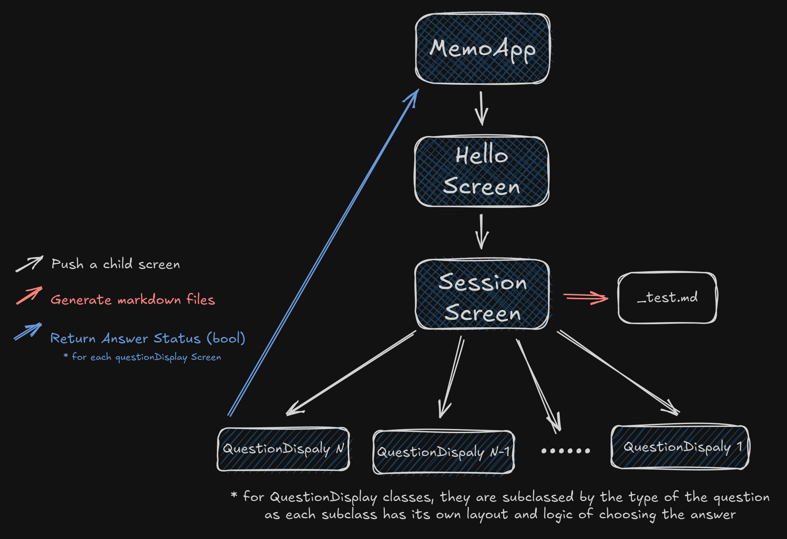
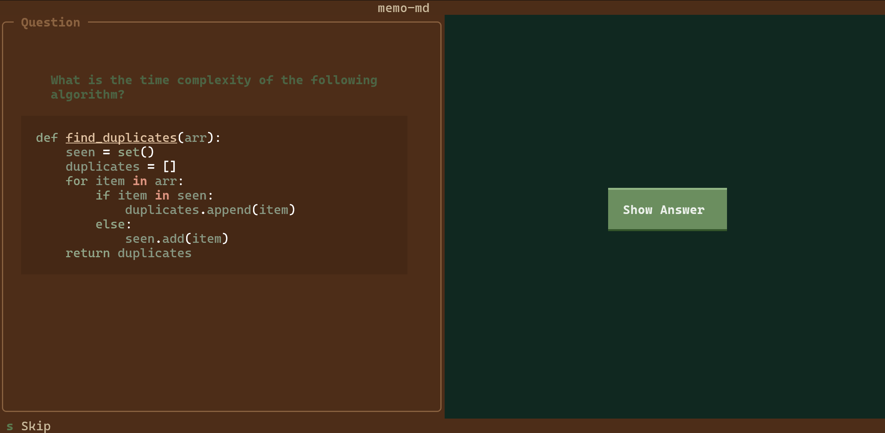
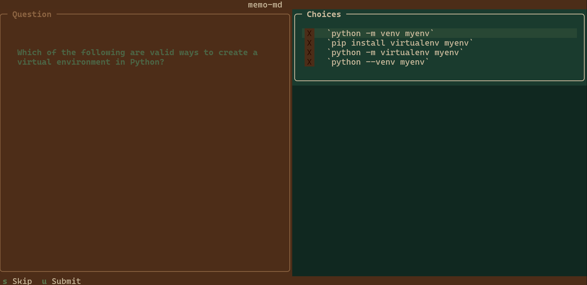

<div align="center">
    
</div>

<div align="center">


</div>

##  Why This Application?

- Keep your flashcards on your computer. No cloud services, no subscriptions, just your files, always available and private.

- Turn any notes into flashcards instantly. Give your AI assistant the format, paste your notes, and get as many cards as you need.

---

##  Simplified Architecture



---

##  Question Types & Format

### 1. Normal Question/Answer

**Format:**
````markdown
# What is the time complexity of the following algorithm?
```python
def find_duplicates(arr):
    seen = set()
    duplicates = []
    for item in arr:
        if item in seen:
            duplicates.append(item)
        else:
            seen.add(item)
    return duplicates
```

<!--seperator-->

**Time Complexity: O(n)**

The algorithm iterates through the array once (n iterations). Set lookup and insertion operations are O(1) on average. Therefore, the overall time complexity is O(n) where n is the length of the array.

---
````

**Preview:**



---

### 2. Multiple Choice Question

**Format:**
```markdown
# Which of the following are valid ways to create a virtual environment in Python?

<!--seperator-->

[*] `python -m venv myenv`
[ ] `pip install virtualenv myenv`
[*] `python -m virtualenv myenv` (if virtualenv is installed)
[ ] `python --venv myenv`

---
```

- Use `[*]` for correct answers
- Use `[ ]` for incorrect options
- Supports multiple correct answers

**Preview:**



---

###  Important Format Rules

- **Separator**: Use `<!--seperator-->` to divide questions from answers
- **Question Divider**: Use `---` to separate different questions
- **File End**: Always end your markdown file with `---`

---

##  Download & Setup

### Option 1: Binary Release (Recommended for Users)

1. Go to the [Releases](https://github.com/georgeibrahim1/memo-md/releases) page
2. Download the latest `memo_md.exe` for Windows
3. Run the executable

### Option 2: From Source with Poetry (For Developers)

#### Prerequisites
- Python 3.9 or higher
- Poetry package manager

#### Installation Steps

1. **Clone the repository**
   ```bash
   git clone https://github.com/georgeibrahim1/memo-md.git
   cd memo-md
   ```

2. **Install Poetry** (if not already installed)
   ```bash
   pip install poetry
   ```

3. **Install dependencies**
   ```bash
   poetry install
   ```

4. **Run the application**
   ```bash
   poetry run python src/app.py
   ```

#### Building Your Own Executable

If you want to build your own executable:

```bash
# Install PyInstaller (already in dependencies)
poetry install

# Build the executable
pyinstaller MemoApp.spec

# Find your executable in dist/MemoApp.exe
```
---

##  License

Apache License 2.0 - feel free to use and modify!

